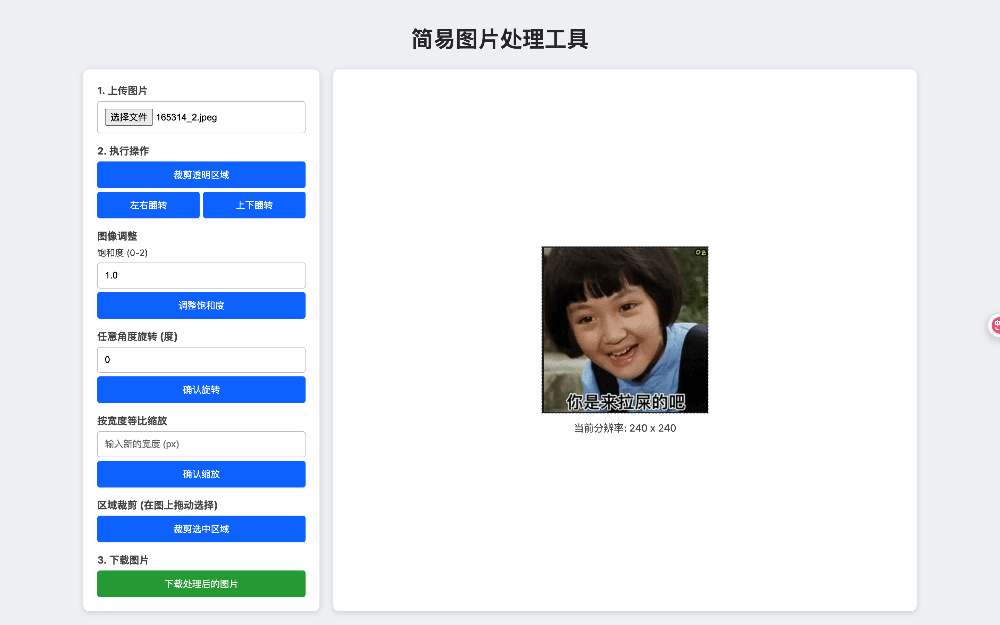

# 简易图片处理工具

这是一个基于 Flask、Pillow 和 OpenCV 库构建的简易图片处理 Web 应用程序。它提供了一个直观的 Web 界面，允许用户上传图片，并进行各种图片操作，包括基本操作、专业调整和滤镜特效。



## 功能

*   **图片上传与自动缩放**: 支持用户从本地上传图片，过大的图片会自动按比例缩小到合理尺寸，以提升处理性能和界面显示效果。
*   **多标签页界面**: 将不同的操作分类到“基本操作”、“专业模式”、“图像调整”和“滤镜特效”选项卡中，界面更整洁。
*   **基本操作**:
    *   **裁剪透明区域**: 自动裁剪图片四周的透明空白区域。
    *   **翻转**: 支持水平和垂直翻转。
    *   **任意角度旋转**: 用户可输入精确的角度旋转图片。
    *   **缩放**: 按宽度等比缩放图片。
    *   **区域裁剪**: 用户可以在图片上拖动选择区域进行精确裁剪。
*   **专业模式（新功能！）**: 提供高级精细化图片调整，包括：
    *   **曝光**: 调整图像的整体亮度。
    *   **色温**: 调整图像的冷暖色调。
    *   **对比度**: 调整图像的明暗反差。
    *   **高光**: 调整图像最亮区域的亮度。
    *   **阴影**: 调整图像最暗区域的亮度。
    *   **自然饱和度**: 智能提升不饱和色彩，保护已饱和色彩和肤色。
    *   **饱和度**: 统一调整所有色彩的鲜艳程度。
    *   **清晰度**: 增强图像中频细节和纹理。
    *   **预设效果**: 一键应用多种风格化预设，如“万物黑金”、“动漫风”、“INS净白”，并支持在此基础上继续手动微调。
*   **图像调整**:
    *   **饱和度**: 调整图像的色彩饱和度。
    *   **亮度**: 调整图像的明暗。
    *   **对比度**: 调整图像的明暗反差。
    *   **清晰度**: 锐化图像边缘，使其更清晰。
*   **滤镜与特效**:
    *   提供多种一键式滤镜，如 **黑白**、**复古**、**反色**、**锐化**、**模糊**、**轮廓**、**边缘增强**、**浮雕**、**细节增强** 和 **平滑**。
*   **撤销操作**: 支持撤销上一步操作，轻松返回到之前的状态。
*   **实时预览**: 所有操作都在前端即时显示效果。
*   **图片下载**: 处理后的图片可以下载到本地。

## 技术栈

*   **后端**:
    *   Python 3
    *   Flask (Web 框架)
    *   Pillow (图像处理库)
    *   OpenCV (高级图像处理，用于专业模式)
    *   NumPy (OpenCV 依赖)
*   **前端**:
    *   HTML5
    *   CSS3
    *   JavaScript (使用 Canvas 进行图片操作和预览)

## 环境搭建与运行

请按照以下步骤在本地设置和运行项目：

### 1. 克隆仓库

首先，将项目仓库克隆到您的本地机器：

```bash
git clone git@github.com:chanf/ImageProcessor.git
cd ImageProcessor
```

### 2. 创建并激活虚拟环境

推荐使用虚拟环境来管理项目依赖：

```bash
python3 -m venv venv
# Windows
.\venv\Scripts\activate
# macOS/Linux
source venv/bin/activate
```

### 3. 安装依赖

激活虚拟环境后，安装 `requirements.txt` 中列出的所有依赖：

```bash
pip install -r requirements.txt
```

### 4. 运行应用

设置 Flask 应用并启动服务器：

```bash
export FLASK_APP=app.py
export FLASK_ENV=development # 或者根据需要设置为 production
flask run --port 5510
```

或者直接运行 `app.py`：

```bash
python app.py
```

应用将运行在 `http://127.0.0.1:5510/`。

### 5. 访问应用

在您的 Web 浏览器中打开 `http://127.0.0.1:5510/` 即可开始使用。

## 使用方法

1.  **上传图片**: 点击 "上传图片" 按钮，选择您想要处理的图片。过大的图片会自动缩小。
2.  **执行操作**:
    *   **基本操作**: 使用“基本操作”选项卡中的按钮进行裁剪透明区域、翻转、旋转、缩放和区域裁剪。
    *   **专业模式**: 切换到“专业模式”选项卡。你可以：
        *   点击上方的预设按钮（如“万物黑金”）一键应用特定风格。
        *   通过拖动下方的滑块，对曝光、色温、高光、阴影、自然饱和度、饱和度、清晰度等参数进行精细调整。
        *   点击“全部重置”按钮可将所有专业参数恢复为默认值。
    *   **图像调整**: 使用“图像调整”选项卡中的滑块和按钮调整亮度、对比度、饱和度和清晰度。
    *   **滤镜与特效**: 切换到“滤镜特效”选项卡，点击不同的按钮应用各种图像滤镜。
3.  **下载图片**: 操作完成后，点击 "下载处理后的图片" 按钮将图片保存到本地。

## 项目结构

```
.
├── app.py                  # Flask 后端应用主文件，处理图片操作 API
├── requirements.txt        # Python 依赖列表
├── templates/
│   └── index.html          # 前端 HTML 页面，提供用户界面
├── uploads/                # 原始图片上传目录 (运行时创建)
└── processed/              # 处理后的图片输出目录 (运行时创建)
```

## 开发路线图 (Roadmap)

以下是计划在未来版本中添加的功能，旨在将此工具打造成一个更全面的图片处理器：

-   **滤镜与特效**:
    -   [x] 黑白
    -   [x] 复古（Sepia）
    -   [x] 反色
    -   [x] 锐化 (Pillow 基础锐化)
    -   [x] 模糊 (Pillow 基础模糊)
    -   [x] 轮廓
    -   [x] 边缘增强
    -   [x] 浮雕
    -   [x] 细节增强
    -   [x] 平滑
    -   [ ] 更多艺术滤镜... (例如，HSL 色彩调整已部分实现作为专业模式的一部分)
-   **图像调整**:
    -   [x] 亮度 (Pillow)
    -   [x] 对比度 (Pillow)
    -   [x] 饱和度 (Pillow)
    -   [x] 曝光 (OpenCV, 专业模式)
    -   [x] 色温 (OpenCV, 专业模式)
    -   [x] 高光 (OpenCV, 专业模式)
    -   [x] 阴影 (OpenCV, 专业模式)
    -   [x] 自然饱和度 (OpenCV, 专业模式)
    -   [x] 清晰度 (OpenCV, 专业模式)
    -   [x] HSL (色相/饱和度/明度) 针对特定颜色 (OpenCV, 后端已支持，前端待完善)
    -   [ ] 色相 (Pillow/OpenCV 更多控制)
-   **旋转与翻转**:
    -   [x] 任意角度旋转
    -   [x] 水平翻转 (左右翻转)
    -   [x] 垂直翻转 (上下翻转)
-   **高级功能**:
    -   [x] **专业模式**: 提供多项精细调整和预设。
    -   [x] **预设效果**: 多个一键应用风格。
    -   [x] **大图自动缩小**: 优化性能。
    -   [x] **撤销操作**: 支持撤销上一步操作。
    -   [ ] **水印添加**: 支持文字或图片水印。
    -   [ ] **格式转换**: 在 PNG, JPEG, WEBP 等格式间转换。
    -   [ ] **图像压缩**: 优化图片文件大小。
    -   [ ] **白平衡**: 更高级的色彩校正工具。
    *   [ ] **文字叠加**: 在图片上添加和自定义文本。
    -   [ ] **背景去除 (AI)**: 智能移除图片背景。
    -   [ ] **图像增强 (AI)**: 提升分辨率、降噪等。
    -   [ ] **对象/人脸检测 (AI)**: 识别并框选出特定对象。
-   **批量处理**:
    -   [ ] 支持一次性对多个图片应用相同的操作。
